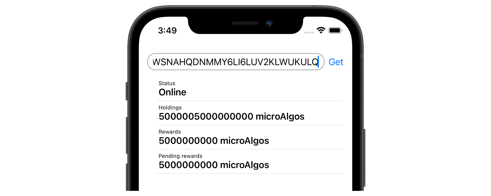

# Algonaut iOS example

Shows how to use [Algonaut](https://github.com/manuelmauro/algonaut) in a native iOS app.

⚠️ Not tested in production yet \*

### Architecture

- Rust core (shareable with other platforms, e.g. [web](https://github.com/i-schuetz/algorand-yew-example)), with domain logic and services, like accessing Algonaut.
- Native app (SwiftUI, etc.)

### Instructions

Install [rust-bitcode](https://github.com/getditto/rust-bitcode) (currently used: [nightly-2021-02-25](https://github.com/getditto/rust-bitcode/releases/tag/nightly-2021-02-25))

As the binaries are not signed, you'll have to convince macOS that it's safe to run them.
One solution is to do the following:

1. `cd algonaut_ios/ios_app`
2. `cargo +ios-arm64-nightly-2021-02-25 build --target aarch64-apple-ios --release --lib`
3. if it fails because macOS doesn't trust the binary, go to
   `System Preferences -> Security & Privacy` and `Allow to run binary`
   then go to 2.

Run the project in Xcode. This will build Rust and start the app.

### Contributing

1. Fork
2. Commit changes to a branch in your fork
3. Push your code and make a pull request

### Acknowledgements

Based on https://github.com/i-schuetz/rust_android_ios. Modifications: Algonaut integration, conversion from async to blocking in FFI interface, Android removed.

\* _It has been tested on real devices but not uploaded to the App Store or distributed. It should™ work, but just in case. If you use an app based on this example in production, please let me know: [ivanhp978@gmail.com](mailto:ivanhp978@gmail.com) or [issues](https://github.com/i-schuetz/algonaut_ios/issues)_
